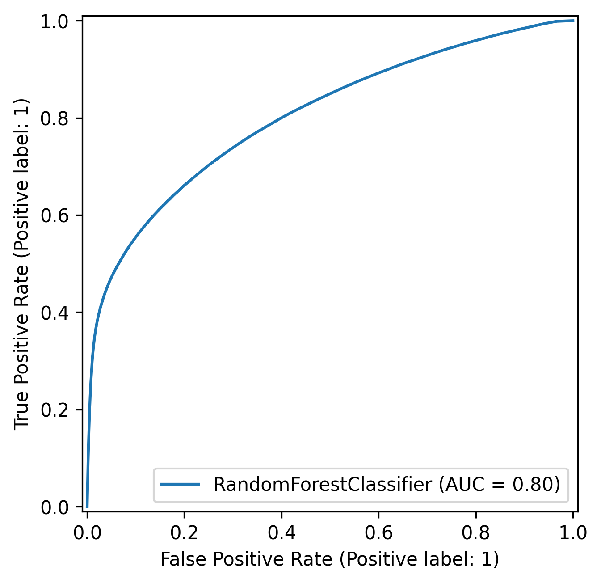
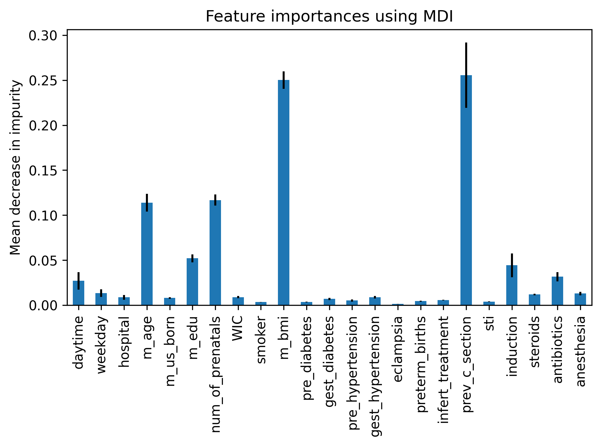

# CDC Birth Data Analysis


A predictive modeling project using CDC birth data to classify whether or not a delivery
will be a C-section.


## Overview

This project applies classification models to CDC birth records to predict C‑section 
outcomes and to identify key maternal and pregnancy factors associated with them. The 
initial motivation came from a personal observation within a small social circle that 
induced labor appeared to correlate strongly with unplanned C‑sections. This prompted 
an investigation into whether the pattern held more broadly; analysis shows the 
correlation is actually negative. The project has since expanded to explore a wider 
range of potential predictors of C‑section deliveries.


## Dataset

- **Source:** [CDC Birth Statistics](https://www.cdc.gov/nchs/data_access/VitalStatsOnline.htm), 
2024 birth data

- **Data:** `raw_data.txt`, fixed-width format, ~3.6M rows, ~280 columns

- **Processing:** Selected 25 relevant features and converted to csv format with
`raw_to_csv.py`, dropped rows with missing values, reformatted columns, and optimized 
data types using pandas

- **Outputs:** `raw_data.csv`, `processed_data.csv`


## Methodology

- **Tools:** Python, pandas, numpy, scipy, matplotlib, seaborn, scikit-learn

- **Models:** Decision Tree as a benchmark, Random Forest, Gradient Boosting  

- **Training:** Used 67/33 train-test split on random sample of 10,000 records for
experimentation and model selection, then on full dataset for final model

- **Hyperparameters:** Compared default settings with GridSearchCV tuning  

- **Evaluation:** Accuracy, recall, and AUC, with emphasis on recall and AUC to minimize 
false negatives (critical in healthcare contexts)


## Results

- **Best model:** Random Forest

- **Accuracy score** = 79%, an 11.4% improvement over the trivial classifier

- **Recall score** = 54%

- **AUC** = 0.80

- **ROC curve:**


- **Feature importances:** 



## Project Structure

```
├── data/                                   # Samples of data used in project
│   ├── interim/
│   │   └── raw_data_sample.csv             # Select columns of raw data converted to CSV
│   ├── processed/
│   │   └── processed_data_sample.csv       # Data ready for use in analysis
│   └── raw/
│       ├── cdc_raw_data_user_guide.pdf     
│       └── raw_data_sample.txt             # Raw data from CDC
├── figures/                                # Generated visualizations from results
│   ├── feature_importances.png
│   └── roc_curve.png
├── notebooks/
│   ├── 01_data-prep.ipynb                  # Data cleaning and preprocessing
│   └── 02_analysis.ipynb                   # Modeling and evaluation
├── scripts/
│   └── raw_to_csv.py                       # Selects features from raw data and converts to csv
├── .gitignore
├── LICENSE
├── README.md
└── requirements.txt
```

## Future work

The accuracy and AUC from the final results are quite promising. Comparing these results to 
[a 2023 study](https://pmc.ncbi.nlm.nih.gov/articles/PMC10422959/) whose model achieves a 
72% accuracy score, I believe that this is only the beginning of a fascinating and important 
line of investigation which deserves more attention. However, the recall score highlights
a fundamental challenge which must be addressed in future work; the ability of a model to
avoid false negatives (i.e. predicting a vaginal birth when a C-section is needed) is
absolutely crucial.

One potential reason for the suboptimal recall performance is that the data doesn't include 
many of the known predictors of a C-section e.g. having twins, prolonged labor, fetal 
position, etc. It also doesn't distinguish between emergency C-sections and C-sections 
planned in advance. I believe this can be seen as a strength rather than a weakness. 
A further investigation of factors which are *not* known to be predictive of a C-section 
has the potential to contribute more to the understanding of C-sections than the already 
well-studied factors. And, indeed, this project shows that there is a nontrivial amount 
of signal to be found in a wide range of factors.


The future of this project lies in incorporating more pre-birth factors, both unintuitive and
well-established, to see just how far a predictive model can be pushed.